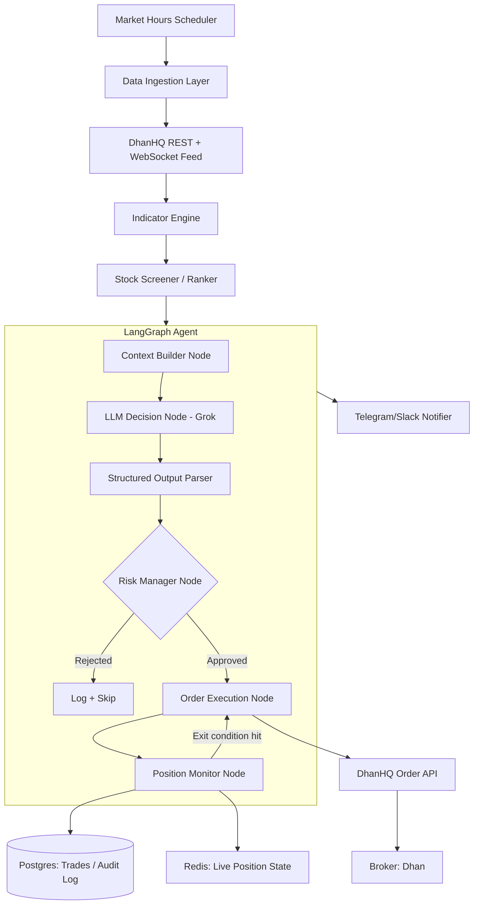

# AI-Automated Intraday Trading System — Roadmap & Implementation Plan

**Stack:** DhanHQ API/SDK · LangGraph · LangChain · Grok (xAI) LLM · Python
**Universe:** NIFTY 50 constituents
**Mode:** Fully autonomous intraday auto-buy / auto-sell, decisions made entirely by an LLM agent

---

## ⚠️ 0. Read This First — Risk & Compliance

This is a system that will place real orders with real money, autonomously, based on LLM output. Before writing a single line of trading logic:

1. **SEBI Algo Trading Framework (retail API algos).** SEBI's 2025 framework for retail algorithmic trading requires that algo strategies executed via broker APIs be registered/tagged with the exchange (through the broker) and assigned an **Algo ID**, with static IP whitelisting for API access. DhanHQ has a specific onboarding flow for this (check Dhan's current "Algo Trading via API" policy page — rules and thresholds change, verify at implementation time, not from this doc).
2. **This project must run in PAPER / DRY-RUN mode for weeks before any real capital is used.** No exceptions. Phase 8 below is non-negotiable.
3. **LLMs hallucinate and are non-deterministic.** An LLM must never be the *only* gate before an order is fired. It proposes; a deterministic, non-LLM **Risk Manager** layer (hard-coded rules) disposes. This is the single most important architectural rule in this document.
4. **Intraday auto square-off:** every open position must be force-closed by ~15:15 IST regardless of what the LLM says, since these are intraday (MIS) positions.
5. Start with **capital you can afford to lose entirely.** Treat the first live month as tuition, not income.

---

## 1. Architecture Overview



**Core principle:** LangGraph gives you a *cyclic* graph — the agent doesn't just run once per stock, it loops: screen → decide → risk-check → execute → monitor → (re-decide on exit conditions) → repeat, until square-off time.

---

## 2. Tech Stack

| Layer | Choice | Notes |
|---|---|---|
| Language | Python 3.11+ | async-first (asyncio) for websocket + concurrent stock loops |
| Broker SDK | `dhanhq` (official Python SDK) + raw REST for anything not covered | Orders, positions, holdings, margin, historical & live data |
| Live data | DhanHQ Market Feed (WebSocket) | Tick-by-tick LTP/OHLC for NIFTY50 basket |
| Agent orchestration | **LangGraph** | Stateful, cyclic graph; checkpointing for crash recovery |
| LLM framework | **LangChain** (`with_structured_output`) | Forces the LLM to return a typed Pydantic decision object, not free text |
| LLM provider | **Grok (xAI API)** via `langchain-xai` | Fallback: Anthropic Claude / OpenAI as a secondary provider for redundancy |
| Indicators | `pandas-ta` or `ta` | RSI, MACD, VWAP, ATR, Bollinger Bands, ADX |
| Storage (durable) | PostgreSQL | Trade log, audit trail, backtest results — regulatory record-keeping |
| Storage (hot) | Redis | Live position state, rate-limit counters, LangGraph checkpoint store |
| Backtesting | `vectorbt` or `backtrader` | Validate strategy + screener before touching live data |
| Scheduling | `APScheduler` inside a long-running asyncio process | Market-hours gating, square-off timer, screener refresh cadence |
| Notifications | Telegram Bot API | Every order, every rejection, every error — pushed in real time |
| Secrets | `.env` (never committed) + `python-dotenv` / OS keyring in prod | Dhan client ID/secret, xAI API key |
| Deployment | Docker container on a small cloud VM (low-latency region) | Or local machine with stable fibre + UPS as a v1 fallback |
| Observability | Structured JSON logs + optional Grafana/Prometheus later | Start simple: file logs + Telegram alerts are enough for v1 |

---

## 3. Repository Structure

```
ai-stock-trader/
├── app/
│   ├── config/
│   │   ├── settings.py            # env-driven config (capital, limits, mode)
│   │   └── nifty50_universe.py    # static + refreshable NIFTY50 symbol list
│   ├── data/
│   │   ├── dhan_client.py         # thin wrapper over dhanhq SDK
│   │   ├── market_feed_ws.py      # live tick websocket consumer
│   │   └── historical.py          # OHLC fetch for indicator warm-up
│   ├── indicators/
│   │   └── compute.py             # RSI/MACD/VWAP/ATR/ADX pipeline
│   ├── screener/
│   │   └── ranker.py              # momentum + volume + volatility scoring
│   ├── agent/
│   │   ├── state.py               # LangGraph TypedDict state schema
│   │   ├── graph.py               # graph wiring (nodes + edges + conditionals)
│   │   ├── llm_client.py          # Grok/xAI LangChain chat model setup
│   │   └── nodes/
│   │       ├── context_builder.py
│   │       ├── llm_decision.py
│   │       ├── risk_manager.py
│   │       ├── order_execution.py
│   │       └── position_monitor.py
│   ├── risk/
│   │   └── rules.py               # deterministic hard limits (non-LLM)
│   ├── execution/
│   │   └── order_manager.py       # idempotent order placement, retries, super orders
│   ├── backtest/
│   │   └── engine.py
│   ├── notify/
│   │   └── telegram.py
│   ├── db/
│   │   ├── models.py              # SQLAlchemy models
│   │   └── session.py
│   └── main.py                    # scheduler entrypoint / market-hours loop
├── tests/
├── scripts/
│   ├── run_backtest.py
│   └── run_paper_trade.py
├── docker/
│   └── Dockerfile
├── .env.example
├── requirements.txt
└── README.md
```

---

## 4. Data Model — LangGraph Agent State

```python
from typing import TypedDict, Literal
from decimal import Decimal

class TradeDecision(TypedDict):
    symbol: str
    action: Literal["BUY", "SELL", "HOLD"]
    quantity: int
    entry_price: float
    stop_loss: float
    target: float
    confidence: float          # 0.0 - 1.0, LLM self-reported
    reasoning: str              # audit trail — why the LLM chose this

class AgentState(TypedDict):
    mode: Literal["paper", "live"]
    timestamp: str
    watchlist: list[str]                    # today's NIFTY50 subset that passed screener
    market_snapshot: dict                   # symbol -> OHLCV + indicators
    llm_decisions: list[TradeDecision]
    risk_approved: list[TradeDecision]
    open_positions: dict                    # symbol -> position detail
    daily_pnl: float
    daily_loss_limit_hit: bool
    square_off_triggered: bool
```

Persisting this state via LangGraph's checkpointer (Redis- or Postgres-backed) means a crash/restart mid-day resumes cleanly instead of losing track of open positions — critical for a system holding real money.

---

## 5. LangGraph Node-by-Node Design

### 5.1 Context Builder Node
Pulls latest tick data + computed indicators for each watchlist symbol, formats a compact structured summary (not raw OHLC dumps — token cost and LLM attention both suffer from noisy input). Include: last price, % change, VWAP deviation, RSI, MACD signal, volume vs. 20-day avg, ATR (for stop-loss sizing), and current position (if any) with unrealized P&L.

### 5.2 LLM Decision Node (Grok via LangChain)
- Use `with_structured_output(TradeDecisionSchema)` so the model is **forced** into the Pydantic schema — no regex-parsing free text.
- System prompt encodes: trading style (intraday momentum), risk appetite, that it must always output a stop-loss and target, that HOLD is a valid and often correct answer, and that it should never "average down" a losing position.
- Temperature low (0–0.3) — this is not creative writing.
- Log the full prompt + response for every single call (compliance + debugging + future fine-tuning corpus).

### 5.3 Risk Manager Node (deterministic — the safety gate)
Hard rules, in code, that no LLM output can override:
- Max capital per single trade (e.g., ≤ 10% of allocated intraday capital)
- Max concurrent open positions (e.g., 3–5)
- Mandatory stop-loss present and within sane ATR-based bounds (reject if LLM proposes no SL or an absurd one)
- Daily max loss circuit breaker (e.g., 2% of capital) → once hit, **halt all new entries for the day**, square off existing, and notify
- No new entries after ~14:45 IST; forced square-off of everything by ~15:15 IST
- Symbol must still be in the live, exchange-tradable NIFTY50 list (handle index reconstitution)

### 5.4 Order Execution Node
- Places order via DhanHQ order API (use **Super Order** / bracket-order style where the SDK supports it, so SL and target are attached atomically rather than as separate manual orders).
- Idempotency key per decision to avoid duplicate orders on retry.
- On failure (margin, rejection, network), log + Telegram alert, do not silently retry blindly — retry with backoff and a max attempt count.

### 5.5 Position Monitor Node
Runs on every tick/poll cycle for open positions: checks SL/target hit, trailing-stop logic if used, and time-based forced exit. Feeds back into the graph so the LLM re-evaluates only when something material changes (avoid calling the LLM every tick — expensive and unnecessary; call it on a timer, e.g. every 3–5 minutes, or on a significant price move).

### 5.6 Conditional Edges
```
context_builder → llm_decision → risk_manager
risk_manager --approved--> order_execution → position_monitor
risk_manager --rejected--> log_and_skip
position_monitor --still_open--> (loop back to context_builder on next cycle)
position_monitor --closed--> log_and_skip
(global) --square_off_time_or_loss_limit--> force_close_all
```

---

## 6. Stock Screener — "High Performing" Definition

Run every N minutes (e.g., every 5–15 min) over the NIFTY50 universe, score and rank, feed only the top K (e.g., 5–8) into the LLM to keep decision latency and token cost sane. Suggested scoring inputs:

- **Momentum:** intraday % change, relative strength vs NIFTY50 index itself
- **Volume surge:** current volume vs. rolling 20-day average at same time-of-day
- **Volatility (tradeable range):** ATR% — enough movement to be worth trading, not so much it's unpredictable
- **Trend confirmation:** price vs VWAP, MACD histogram direction, ADX for trend strength
- **Liquidity floor:** exclude anything with wide bid-ask spread or low depth (even within NIFTY50, always sanity check depth before sizing an order)

This screener is deterministic code, not LLM — the LLM's job starts *after* the universe is narrowed, deciding directional bias and sizing/timing, not scanning 50 stocks itself.

---

## 7. Roadmap & Phases

| Phase | Deliverable | Est. Duration |
|---|---|---|
| **0. Research & Compliance** | Confirm Dhan's current retail-algo API rules, complete any required KYC/algo registration, static IP setup, sandbox/paper API access confirmed | 3–5 days |
| **1. Environment Setup** | Repo scaffolded, Dhan API keys working, `.env` config, Postgres + Redis running (Docker Compose) | 2–3 days |
| **2. Data Layer** | Historical OHLC fetch working, WebSocket live feed consuming NIFTY50 ticks reliably, reconnect/backoff handling | 1–2 weeks |
| **3. Indicator + Screener Engine** | RSI/MACD/VWAP/ATR pipeline; screener producing a ranked daily/intraday watchlist; unit-tested against known values | 1 week |
| **4. LangGraph Agent Core** | Full graph wired with stub nodes; state schema finalized; Grok LLM returning structured decisions in a sandbox script | 1.5–2 weeks |
| **5. Risk Manager Layer** | All hard-coded rules implemented and unit-tested with adversarial inputs (LLM proposing oversized/no-SL trades and getting rejected) | 1 week |
| **6. Order Execution Engine** | Real order placement wired to Dhan (paper endpoint first), idempotency, retries, super-order SL/target attach | 1 week |
| **7. Backtesting** | Replay historical data through screener + a rules-based proxy of the LLM logic (or logged historical LLM decisions) to sanity-check the strategy before paper trading | 1–2 weeks |
| **8. Paper Trading (mandatory)** | Full system live-connected but placing **paper/simulated** orders only, for a minimum of **4 continuous weeks** across varied market conditions | 4+ weeks |
| **9. Live — Minimum Capital** | Switch to live orders with the smallest capital the broker allows, 1 position at a time, manual kill-switch always ready | 2–4 weeks, gradual scale-up only after consistent behavior |
| **10. Monitoring & Iteration** | Dashboards, daily P&L reports, weekly strategy review, prompt/rule tuning based on logged decisions vs. outcomes | Ongoing |

**Total to first live rupee, done responsibly: ~10–14 weeks** of part-time work minimum — most of that is Phase 8, which should not be compressed.

---

## 8. Risk & Capital Management Rules (Starting Defaults — Tune Later)

- Allocate a fixed **trading capital pool**, separate from other funds — never trade against your full account balance.
- Per-trade risk: ≤ 1–2% of the trading capital pool (position size derived from stop-loss distance, not a fixed quantity).
- Max 3–5 concurrent open positions.
- Daily loss circuit breaker: 2% of trading capital → halt for the day.
- Weekly loss circuit breaker: 5% of trading capital → halt for the week, human review required before resuming.
- Every order has a stop-loss attached at entry — no exceptions, no "I'll watch it manually."
- Forced square-off of all MIS positions by 15:15 IST.
- Kill switch: a single command/flag that immediately stops new entries and square-offs everything — test this before going live, not during a crisis.

---

## 9. LLM Prompting Notes

- Keep the system prompt stable and versioned (log which prompt version produced which decision — you will want to correlate performance to prompt changes).
- Structured output only (Pydantic schema via LangChain) — never parse free-form text for trading actions.
- Always give the LLM the option to say HOLD/no-trade with no penalty framing — a system that never says "no" is a red flag.
- Include recent realized outcomes (e.g., "your last 3 decisions on RELIANCE: +0.4%, -0.8%, HOLD") as context — gives the model a feedback loop within a session without needing fine-tuning.
- Consider a secondary "critic" LLM call or a second provider (e.g., Claude) that reviews the primary decision before execution, for an extra layer of sanity-checking on higher-conviction/larger-size trades — optional but valuable given LLM non-determinism.

---

## 10. Testing Strategy

- **Unit tests:** indicator math, screener scoring, risk-rule edge cases (LLM adversarial/malformed outputs).
- **Integration tests:** Dhan API wrapper against Dhan's sandbox/paper endpoints.
- **Backtests:** full historical replay, report Sharpe, max drawdown, win rate, avg R-multiple — not just total P&L.
- **Paper trading:** the real integration test — full system, real-time data, simulated fills, for weeks.
- **Chaos tests:** kill the process mid-position and confirm state recovery via the LangGraph checkpointer + DB reconstructs open positions correctly.

---

## 11. Open Decisions to Revisit

- Grok as sole LLM vs. dual-provider consensus (Grok + Claude) for higher-conviction trades.
- Whether to add a news/sentiment node (extra latency + cost vs. extra signal) — recommend deferring to v2.
- Local always-on machine vs. cloud VM — cloud wins on uptime/latency but adds infra cost and secret-management surface area.
- Fixed watchlist size (K) — start with 5, tune based on backtest + paper-trade token cost vs. missed-opportunity tradeoff.

---

*This document is a planning artifact, not financial advice. Trading involves risk of loss. Verify all regulatory requirements (SEBI, exchange, and DhanHQ-specific algo API rules) directly with current official sources before deploying live capital.*
